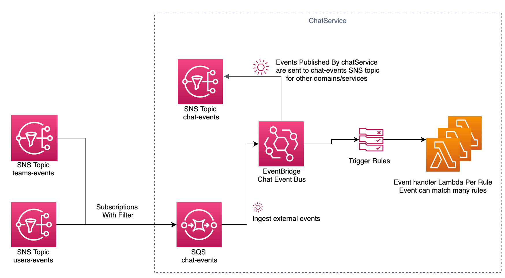

# EventBridge Proof Of Concept

This mini project accompanies an internal blog, this makes some real infrastructure in order to be able to link to things in the blog in order to ground examples in actual code.

This creates an imaginary chat service that uses EventBridge to route events from its incoming `chat-events` SQS Queue to destination lambdas within the service. It subscribes to events from other domains/services through normal SNS subscriptions onto its incoming event SQS queue. This is forfilling the same functionality as the in house Message-Router, but with the major advantage that aws is responsible for it.

To publish events the service publishes events to the chatEventBus, all events published by the chat service (identified by the union type `chat.*`) are then sent to the chat service chat-events SNS topic. This means that other domains are coupled to this service in an identical manner to pure SNS/SQS means.

## Service Architecture Diagram:

## Project Structure

### service

Contains all the service code for the lambda handlers. The lambda handlers log out the event payload they are invoked with and exit.

### web_app

contains an ultra minimal app that allows you to publish events to the service via a web view, see blog for link.

### Cloudformation Infrastructure

AWS SAM has been used to create the infrastructure, see the project root for the templates. `infrastructure_template` is the stack root. 
